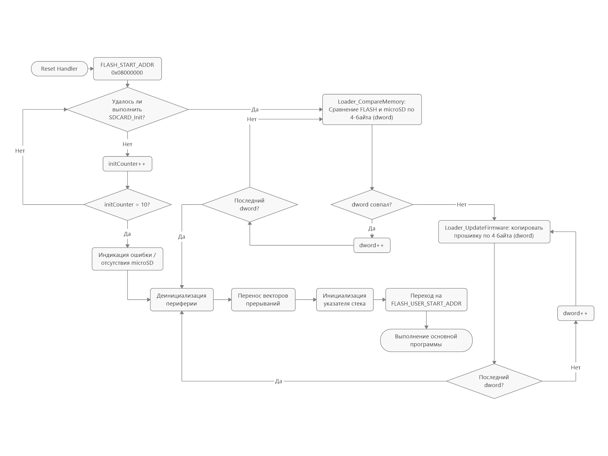

# MicroSdBootloader

Здесь располагается прошивка microSD-загрузчика.

* Работает с SDHC/SDXC картами. За основу взята [библиотека](https://github.com/afiskon/stm32-sdcard) Александра Алексеева.
* Прошивка должна быть в формате `.bin` и располагаться с первого сектора microSD. 
* В нулевом секторе должен быть записан флаг (`0xFEEDBABE`), который проверяется перед сравнением памяти. (Временное решение, т.к. мой основной проект пока что не позволяет вместить FatFs)

| Упрощенная блок-схема                       |
| ------------------------------------------- |
|  |

## Структура проекта

* `Core` - файлы сгенерированные CubeIDE, здесь лежит и `main.c`
* `Source` - пользовательские исходники 
  * `Flash.c` - функции для работы с Flash-памятью STM-32
  * `Loader.c` - основной функционал загрузчика
* `Include` - пользовательские заголовки
  * `Common.h`
  * `Flash.h`
  * `Loader.h`

## Как пользоваться

1. Импортировать файл `MicroSdBootloader.ioc` в CubeIDE
2. Сгенерировать код (*Alt + K*) в CubeIDE

Если потребуется отладить:

1. Отключить оптимизацию
2. Изменить размер загрузчика:
   1. В файле `Flash.h` изменить `FLASH_USER_START_ADDR`, раскоментив нужный дефайн
   2. В файле `STM32F101C4TX_FLASH.ld` изменить `FLASH` `LENGTH` в блоке `MEMORY`

